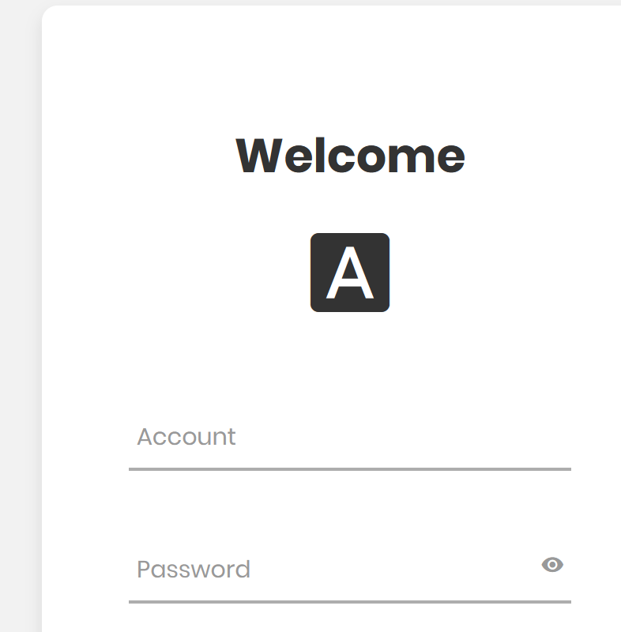

# MoeCTF 2022-wp

# WEB篇

## [MoeCTF 2022]baby_file


file伪协议

payload：

```
?file=php://filter/read=convert.base64-encode/resource=flag.php
```

## [MoeCTF 2022]ezhtml

flag就在js里面

## [MoeCTF 2022]what are y0u uploading？

文件上传

要求是图片hint说穿一个f1ag.php给flag

直接bp改

## [MoeCTF 2022]ezphp


考点变量覆盖

首先要echo  flag，那么就不能执行exit则不能不输入flag，但是输入了flag会替换原本的flag

所有先用a存放flag的值在吧flag=a

payload：

```
?a=flag&flag=a
```

```
select username,password from users where username="admin" or "1--+" && password="'.$password.'";
```

## [MoeCTF 2022]Sqlmap_boy



一个登录界面

构造万能密码admin"/**/or/**/"1--+跳转到secrets.php?id=1页面存在sql注入直接sqlmap一把梭（要加cookie！！！）

对于跳转另一个姿势

先F12，看到有注释提示sql语句`<!-- $sql = 'select username,password from users where username="'.$username.'" && password="'.$password.'";'; -->`


根据此语句构造注入语句`'"="'`，这样后面会变成`"'.'"="'.'"`的恒真表达式。·


## [MoeCTF 2022]cookiehead

自己做加xff没有回显看评论好像题目有问题直接拿别人wp


打开网页看到“仅限本地访问”，于是拉到 burpsuite 中添加一行 `X-forwarded-For: 127.0.0.1`，提示变为“请先登录”。看到下面有一行`Cookie: login=0`，把0改为1，提示又变为“You are not from http://127.0.0.1/index.php !”，于是加上`Referer: http://127.0.0.1/index.php`，拿到flag

## [MoeCTF 2022]God_of_aim

一个类似练枪法定位的网站分别拿到10和100000分可以拿到flag

~~直接玩到100000~~

查看js，发现aimtrainer.js里面有东西直接hex解码拿到flag

~~拿到flag后提交失败，然后看评论估计答案设置有问题~~

# misc篇

## [MoeCTF 2022]nyanyanya

拿到图片从010看到最后提示了一个lsb

用工具查lsb三个0得到flag

3：zJzZ_a

## [MoeCTF 2022]cccrrc

顾名思义crc爆破

给了一个压缩包直接crc32爆破

6d6f656374667b7177715f637263217d

解码后

moectf{qwq_crc!}

## [MoeCTF 2022]usb

很明显是usb接口的流量分析

将usbhid的数据提取出来

```
tshark -r usb.pcapng -T fields -e usbhid.data > usbdata.txt
```

对数据进行预处理

```
f=open('usbdata.txt','r')
fi=open('out.txt','w')


for line in f:
	out=""
	line = line.strip("\n")
	if len(line)==16:
		for i in range(0,len(line),2):
			if i+2 != len(line):
				out+=line[i]+line[i+1]+":"
			else:
				out+=line[i]+line[i+1]
		fi.write(out)
		fi.write('\n')
		print(out)
```

加上大佬的脚本

```
normalKeys = {
    "04":"a", "05":"b", "06":"c", "07":"d", "08":"e",
    "09":"f", "0a":"g", "0b":"h", "0c":"i", "0d":"j",
     "0e":"k", "0f":"l", "10":"m", "11":"n", "12":"o",
      "13":"p", "14":"q", "15":"r", "16":"s", "17":"t",
       "18":"u", "19":"v", "1a":"w", "1b":"x", "1c":"y",
        "1d":"z","1e":"1", "1f":"2", "20":"3", "21":"4",
         "22":"5", "23":"6","24":"7","25":"8","26":"9",
         "27":"0","28":"<RET>","29":"<ESC>","2a":"<DEL>", "2b":"\t",
         "2c":"<SPACE>","2d":"-","2e":"=","2f":"[","30":"]","31":"\\",
         "32":"<NON>","33":";","34":"'","35":"<GA>","36":",","37":".",
         "38":"/","39":"<CAP>","3a":"<F1>","3b":"<F2>", "3c":"<F3>","3d":"<F4>",
         "3e":"<F5>","3f":"<F6>","40":"<F7>","41":"<F8>","42":"<F9>","43":"<F10>",
         "44":"<F11>","45":"<F12>"}
shiftKeys = {
    "04":"A", "05":"B", "06":"C", "07":"D", "08":"E",
     "09":"F", "0a":"G", "0b":"H", "0c":"I", "0d":"J",
      "0e":"K", "0f":"L", "10":"M", "11":"N", "12":"O",
       "13":"P", "14":"Q", "15":"R", "16":"S", "17":"T",
        "18":"U", "19":"V", "1a":"W", "1b":"X", "1c":"Y",
         "1d":"Z","1e":"!", "1f":"@", "20":"#", "21":"$",
          "22":"%", "23":"^","24":"&","25":"*","26":"(","27":")",
          "28":"<RET>","29":"<ESC>","2a":"<DEL>", "2b":"\t","2c":"<SPACE>",
          "2d":"_","2e":"+","2f":"{","30":"}","31":"|","32":"<NON>","33":"\"",
          "34":":","35":"<GA>","36":"<","37":">","38":"?","39":"<CAP>","3a":"<F1>",
          "3b":"<F2>", "3c":"<F3>","3d":"<F4>","3e":"<F5>","3f":"<F6>","40":"<F7>",
          "41":"<F8>","42":"<F9>","43":"<F10>","44":"<F11>","45":"<F12>"}
output = []
keys = open('out.txt')
for line in keys:
    try:
        if line[0]!='0' or (line[1]!='0' and line[1]!='2') or line[3]!='0' or line[4]!='0' or line[9]!='0' or line[10]!='0' or line[12]!='0' or line[13]!='0' or line[15]!='0' or line[16]!='0' or line[18]!='0' or line[19]!='0' or line[21]!='0' or line[22]!='0' or line[6:8]=="00":
             continue
        if line[6:8] in normalKeys.keys():
            output += [[normalKeys[line[6:8]]],[shiftKeys[line[6:8]]]][line[1]=='2']
        else:
            output += ['[unknown]']
    except:
        pass

keys.close()

flag=0
print("".join(output))
for i in range(len(output)):
    try:
        a=output.index('<DEL>')
        del output[a]
        del output[a-1]
    except:
        pass

for i in range(len(output)):
    try:
        if output[i]=="<CAP>":
            flag+=1
            output.pop(i)
            if flag==2:
                flag=0
        if flag!=0:
            output[i]=output[i].upper()
    except:
        pass

print ('output :' + "".join(output))
```


## [MoeCTF2022]what_do_you_recognize_me_by

修复png文件头后扫描二维码拿到flag

## [MoeCTF 2022]Locked_bass

压缩包伪加密+b64解码


## [MoeCTF 2022]rabbit

给了一个兔子的图片一直没什么思路就看到010中有一串特殊的asc不知道是什么加密，看了一下wp原来还有rabbit加密直接解密得flag

## [MoeCTF 2022]小纸条已解决

猪圈密码看图解密

## [MoeCTF 2022]CCCC

把代码拉到编译器跑一下就出来了

## [MoeCTF 2022]Misc指北

签到

## [MoeCTF 2022]Python

在python运行得flag

## [MoeCTF 2022]run_me

在cmd运行

## [MoeCTF 2022]A_band

套都可以套

BIN > HEX >AAEncode>base32>base58>base64 得到flag

## [MoeCTF 2022]Bell202

安装 http://www.whence.com/minimodem/

```
minimodem --rx -f encoded.wav 1200
```

## [MoeCTF 2022]想听点啥

突破口怎么打开.mscz （MuseScore 3 ）

打开后拿到压缩包密码

```
# this is not flag, but real flag will be encrypted in same algorithm.
flag = 'moectf{xxxxxxxxxxxxxxxxxxxxx}'

def encrypt(src: str) -> bytes:
    return bytes([ord(src[i]) ^ ord(src[i-1]) for i in range(1, len(src))])

with open('flag.txt', 'wb') as out:
    out.write(encrypt(flag))
```

发现对flag的内容进行了异或

贴一个别人的脚本

```
flag = 'moectf{xxxxxxxxxxxxxxxxxxxxx}'

def encrypt(src: str) -> bytes:
    return bytes([ord(src[i]) ^ ord(src[i-1]) for i in range(1, len(src))])

f = open("functions\\mister\\flag.txt",'rb')
bits = f.read()
f.close()
print(len(bits))

pre = ord('m')
print('m',end='')
for b in bits:
    c = b ^ pre
    print(chr(c),end='')
    pre = c
#
```

## [MoeCTF 2022]hamming

汉明码去除噪声新知识

参考大佬：https://www.bilibili.com/video/BV1WK411N7kz

给出了三个文件，一个加密，一个解密，一个加密后的数据 所以我要做的就是补全解密脚本

大佬的exp：

```
#from polar_router import recv_over_weak_noisy_channel#how it works doesn't matter, u don't need this lib, just ignore it
from Crypto.Util.number import long_to_bytes#really useful! 
from noisemsg import noisemsg

def hamming_correct(bitblock):
    for i in range(16):
        if bitblock[1]^bitblock[3]^bitblock[5]^bitblock[7]^bitblock[9]^bitblock[11]^bitblock[13]^bitblock[15]!=0 or bitblock[2]^bitblock[3]^bitblock[6]^bitblock[7]^bitblock[10]^bitblock[11]^bitblock[14]^bitblock[15]!=0 or bitblock[4]^bitblock[5]^bitblock[6]^bitblock[7]^bitblock[12]^bitblock[13]^bitblock[14]^bitblock[15]!=0 or bitblock[8]^bitblock[9]^bitblock[10]^bitblock[11]^bitblock[12]^bitblock[13]^bitblock[14]^bitblock[15]!=0:
            bitblock[i]=int(not bitblock[i])
            if bitblock[1]^bitblock[3]^bitblock[5]^bitblock[7]^bitblock[9]^bitblock[11]^bitblock[13]^bitblock[15]==0 and bitblock[2]^bitblock[3]^bitblock[6]^bitblock[7]^bitblock[10]^bitblock[11]^bitblock[14]^bitblock[15]==0 and bitblock[4]^bitblock[5]^bitblock[6]^bitblock[7]^bitblock[12]^bitblock[13]^bitblock[14]^bitblock[15]==0 and bitblock[8]^bitblock[9]^bitblock[10]^bitblock[11]^bitblock[12]^bitblock[13]^bitblock[14]^bitblock[15]==0:
                bitblock[i]=int(not bitblock[i])
                #print(i)
                return i
            else:bitblock[i]=int(not bitblock[i])
        #else :print('no')
    return 0
    #you should write this function, to help polar decode the msg
    #Good luck and take it easy!

def decode(msg):
    blocks=len(msg)
    bitlist=[]
    #Let's cancel the noise...
    for i in range(blocks):
        wrongbitpos=hamming_correct(msg[i])
        msg[i][wrongbitpos]=int(not msg[i][wrongbitpos])
        #add corrected bits to a big list
        bitlist.extend([msg[i][3]]+msg[i][5:8]+msg[i][9:16])
    #...then, decode it!
    totallen=len(bitlist)
    bigint=0
    for i in range(totallen):
        bigint<<=1
        bigint+=bitlist[i]
    return long_to_bytes(bigint)

msg=decode(noisemsg)
print(msg)#Well done
```

## [MoeCTF 2022]寻找黑客的家

图中高德直接出汉明宫足浴理疗

