# CTFSHOW-爆破

## WEB21

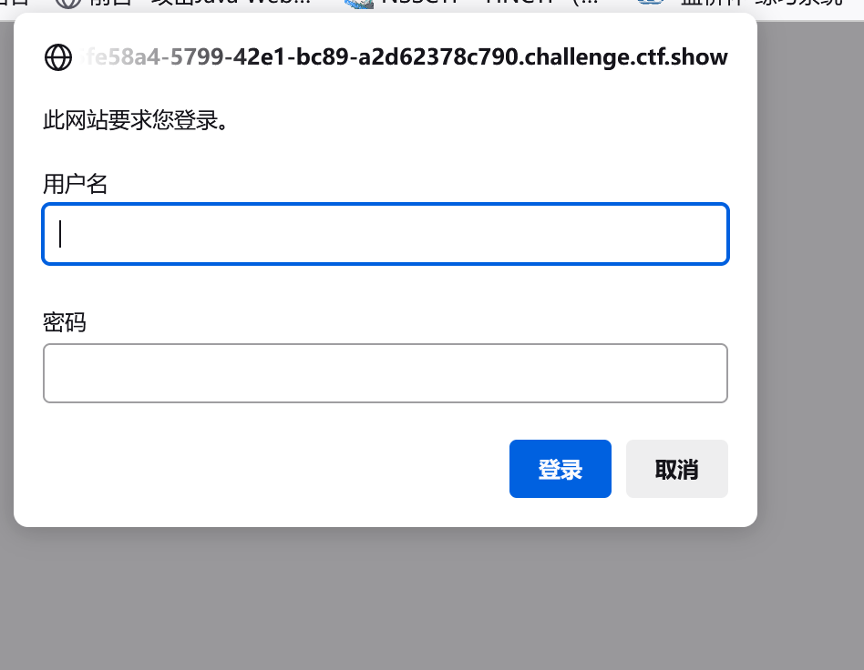

用户名密码爆破

题目还给了个字典直接用户名：admin+字典中的密码

尝试admin+123456抓包后发现是base64编码解码后：

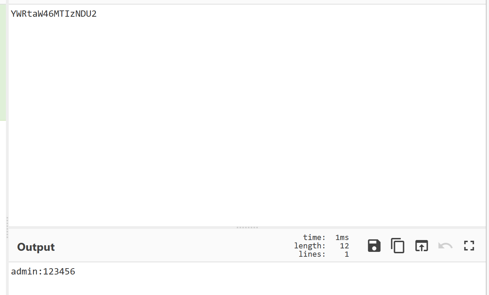

发现格式admin：123456

用bp爆破

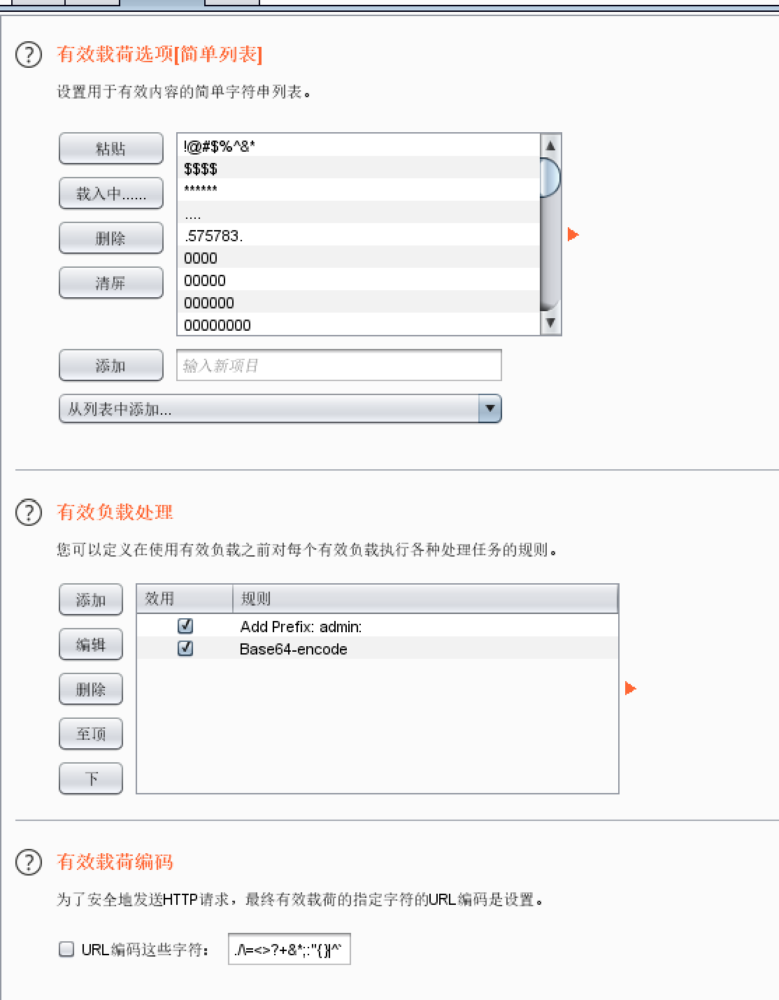

下面的url编码要去掉不然=被编码会影响base64结果

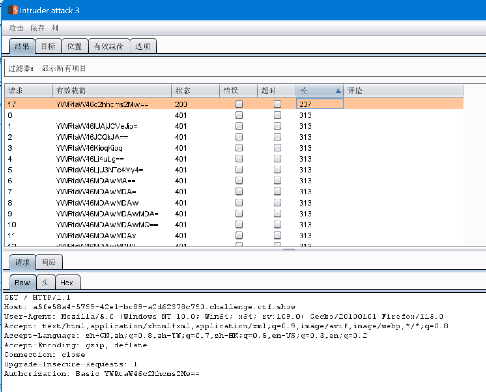

拿到密码得到flag

## WEB23

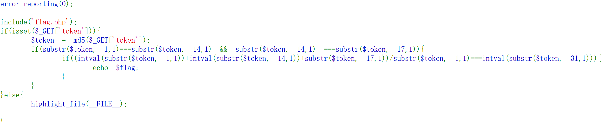

发现要让token满足if的需求直接脚本爆破

exp：

```php
<?php

/*

for($i;$i<10000;$i++){
    $token= md5($i);
    if(substr($token, 1,1)===substr($token, 14,1) && substr($token, 14,1) ===substr($token, 17,1)){
        if((intval(substr($token, 1,1))+intval(substr($token, 14,1))+substr($token, 17,1))/substr($token, 1,1)===intval(substr($token, 31,1))){
            echo $i.' md5:'.$token;
        }
    }
}
?>
```

得到当i=422时可得到flag

## WEB24


要使输入的值等于随机数的值

但是随机数都是伪随机可以通过种子得到第一个值

exp：

```
<?php   

 mt_srand(372619038);    

$randomNumber = mt_rand();    

echo $randomNumber; 

?>
```

得到1155388967输入后得到flag

## WEB25

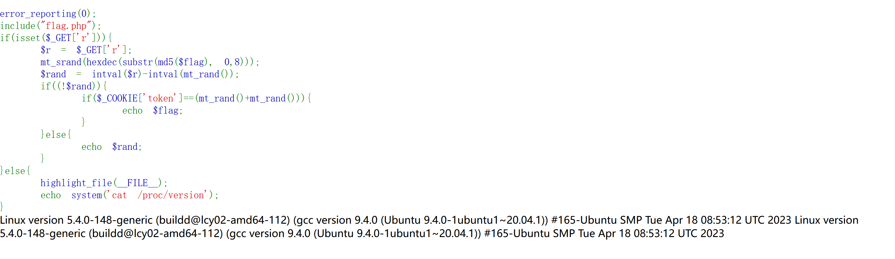

先输入r=0

得到第一个随机数-1996755105

kali下载工具php_mt_seed，下载网站：https://github.com/Al1ex/php_mt_seed
打开控制台，进入工具所属文件夹
输入make命令后，ls查看，得到文件php_mt_seed

time ./php_mt_seed  第一个随机数

当rand的值为0时，如果COOKIE token的值为第二个随机数与第三个随机数之和，输出flag，因此我们再写一个php文件

```
<?php
mt_srand(第二个随机数);
echo mt_rand()."\n";
echo mt_rand()+mt_rand();
```

token=2270937165;

穿入后得到flag

1791607709

## WEB26

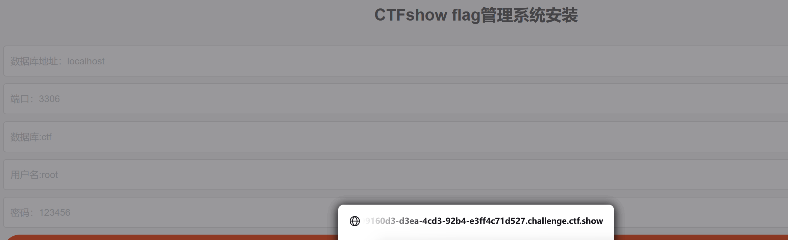

开局一个登录应该是爆破密码

先空着提交抓包看看发了什么

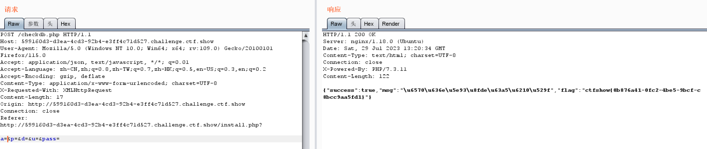

一个是非预期直接出flag了

正常解爆破密码7758521得到flag

## WEB27

题目是一个学生系统登录界面

给了所有人的信息身份证中间生日部分变*了

提示说用姓名加身份证登录

直接bp爆破身份证

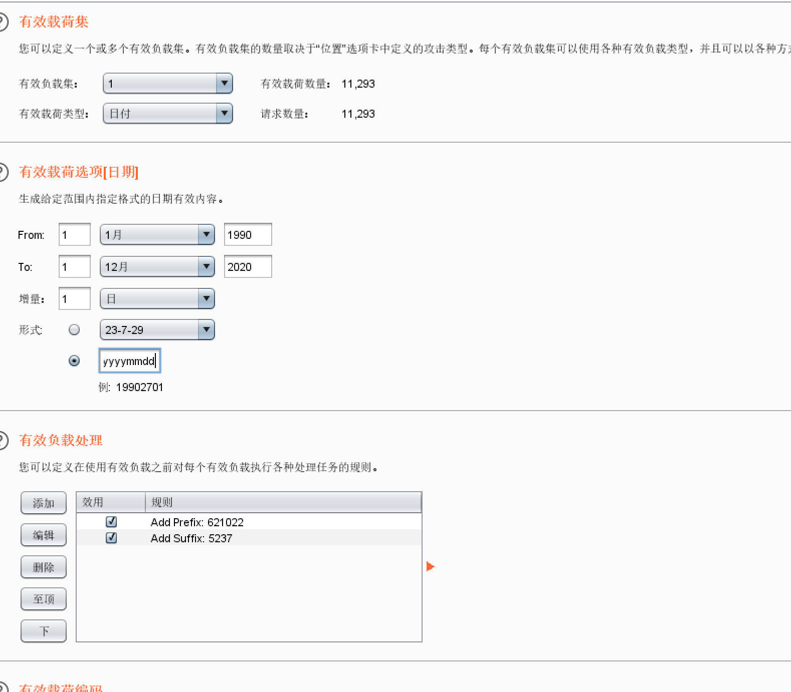、


姓名高先伊，身份证：621022199002015237

## WEB28

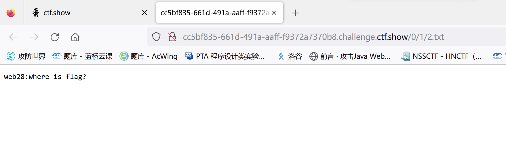

奇奇怪怪的目录猜一下爆破目录hint说去掉2.txt


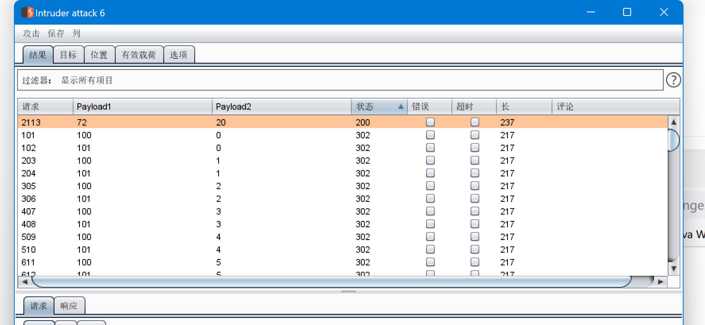

得到flag